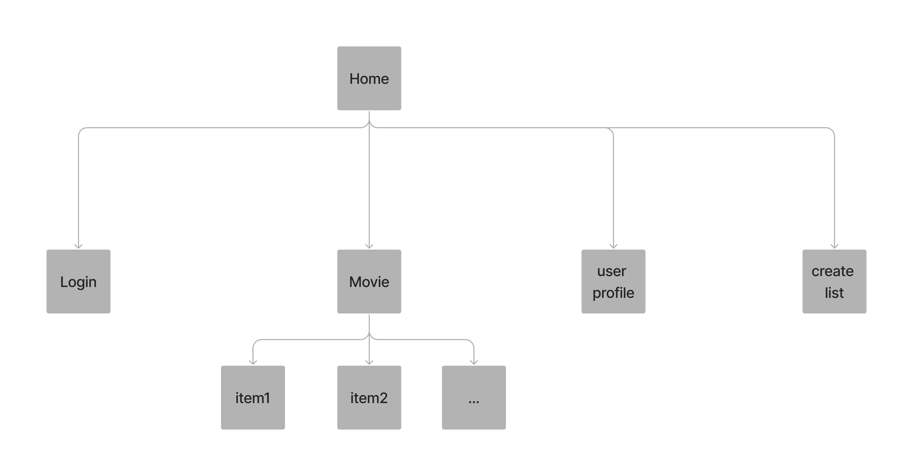

# [Violet Critics] (http://www.violetcritics.com/)

## Overview

Loving watching movies and want to find a movie that receives higher ratings among your peers? Want to see the true reviews for certain movies? Our web app Violet Critics will be your first choice!

Violet Critics is a web app that will allow users to keep track of trendy movies and upload their ratings and reviews. Users can register and login. Once they're logged in, they can create or view their own movie list. For every list that they have, they can add new movies that they watched recently to the list. In addition, the app can also recommend movies for each user according to their movie list.


## Data Model

The application will store `Users`, `Lists` and `Movies`

* users can have multiple movie lists (via references)
* each list can have multiple movies (by embedding)

An Example User:

```javascript
{
  _id: ObjectId("6379549de9f52717e934296c"),
  favgenres: [],
  starlists: [ ObjectId("637954b1e9f52717e9342979") ],
  username: 'bernice',
  salt: 'bd1a3d2392d7928170c5a15f37b3a3a77664e522de264ff08ae7ace5cfdf5f5e',
  hash: 'ccbb709c4410812ea9052e27dc8d034b8c06421478d618d3dd7a74977e910de33d4e293cdd0782960b9f9fcea7c406cb719169ea9b4c1c1026cbe0fdba3629f300622bcecd5739a13d2aa3e40e9f11b1794bf3282e56bea9c58b06aa174814d56fa95336375e0014a143ac06acb22d18a5aff1e8b897780d9c6cd1b14b356dda86f90de332ee2c0a4a24e4405e662e0eb52153d0db8b9ac7ff2a78224e8b53e3b83404d931ca3f2f9e8fb8c790509c5453a5179983a582a7d3e04b58ac2f1c9212eaf964dcd05e7092fb54d30ba8161167388de63a7d76867d7eb744fcefdd1cc8c713328b695f2111a17197c154591782cf060612e94f5dba6da4253ed039f1779ec9be240bb0f441a94df790caf2c94b09f3a1320cec71cc441a43218e5363579cd3f50463ed5af65a27a638d22ce20ca79196a6b41722f15b2edddac98cd15a34b98f9bbd8aeb6b5c9123228c6eceda06d58e4839b07e66b300024f502468984bd39b140185882630a1bddf104b2a2612f6b81f9a20e587fa2d20871c121770e5c3abb0afd9dacb9863198a68fce6d9da81272a1b173539fec17242c24b64505e5150be3d5912e27d052286bc911572cf8c7f85706f33e0f9811f46dda3b4b58a98db1d69e786f14c4aea8514542afb8e710ce7745b8d784ec4371e94947d3b168fe69922e12818693643886611871bc7fbbee3c0bdebde6f0a12e0cd786c',
  __v: 0
}
```

An Example Movie:

```javascript
{
  _id: ObjectId("63792f260925d920756f686e"),
  name: 'MexZombies',
  overview: 'A group of teenagers must face a zombie apocalypse, and help reestablish order.',
  poster: 'https://image.tmdb.org/t/p/original/85zufUxhD97k2s5Bu2u101Qd8Sg.jpg',
  directors: [],
  main_actors: [
    'Bárbara de Regil',
    'Iñaki Godoy',
    'Sara Maldonado',
    'Vincent Michael Webb',
    'Mayra Batalla'
  ],
  release_date: '2022-10-26',
  genre: [ 'Horror', 'Action', 'Comedy' ],
  time: '93',
  rating: 7.228,
  reviews: [],
  href: '',
  slug_history: [ 'mexzombies' ],
  slug: 'mexzombies',
  __v: 0
}
```

An Example `MovieList` with Embedded Items:
```javascript
{
  _id: ObjectId("637954b1e9f52717e9342979"),
  list_name: 'STAR',
  items: [
    ObjectId("63792f260925d920756f6866"),
    ObjectId("63792f260925d920756f6868")
  ],
  createdAt: ISODate("2022-11-19T22:12:01.381Z"),
  __v: 0
}
```


## [Link to Commented First Draft Schema](db.mjs) 

## Wireframes

/ - Home page for Violet Critics, list all the movies


/movie/interstellar - page for a specific film


/starlist - page for showing all starred movie lists


/login - page for users to log in


## Site map



## User Stories or Use Cases

1. as non-registered user, I can register a new account with the site
2. as a user, I can log in to the site
3. as a user, I can create a new movie list
4. as a user, I can view all of the movie lists I've created in a single list
5. as a user, I can rate and review each movie
6. as a user, I can view all the movie database in homepage

## Research Topics

* (5 points) Integrate user authentication
    * I'm going to be using passport for user authentication
    * And account has been made for testing;
    * see <code>http://linserv1.cims.nyu.edu:41052/register</code> for register page
    * see <code>http://linserv1.cims.nyu.edu:41052/login</code> for login page
* (3 points) Use axios to fetch the API
    * learn axios on AJAX 
    * use async axios functions to realize mutiple parallel requests
* (4 points) themoviedb API 
    * get general movie database: [Discover](https://developers.themoviedb.org/3/discover/movie-discover)
    * Get detailed information about the movie: [Get Details](https://developers.themoviedb.org/3/movies/get-movie-details)
    * Get credits information (casts, directors) of each movie: [Get Credits](https://developers.themoviedb.org/3/movies/get-movie-credits)
* (3 points) Configuration management
    * use .env to store the credential information


## [Link to Initial Main Project File](app.mjs) 


## Annotations / References Used

1. [passport.js authentication docs](http://passportjs.org/docs) 
2. [axios](https://www.npmjs.com/package/axios)
3. [themoviedb api - DISCOVER](https://developers.themoviedb.org/3/discover/movie-discover) 
4. [themoviedb api - Get Details](https://developers.themoviedb.org/3/movies/get-movie-details) 
5. [themoviedb api - Get Credits](https://developers.themoviedb.org/3/movies/get-movie-credits)
6. [dotenv](https://www.npmjs.com/package/dotenv)

